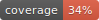
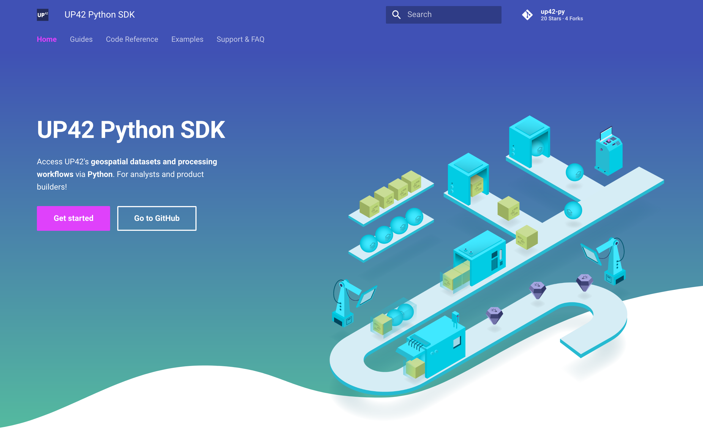
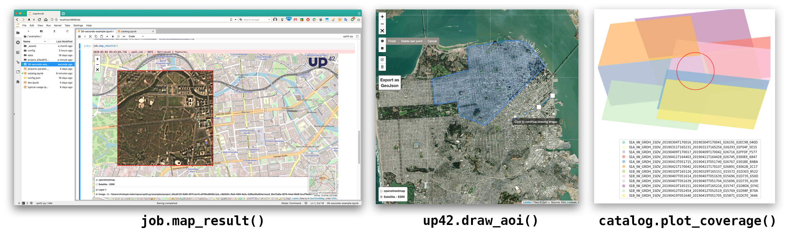

<p align="center">
    <strong>Python SDK for UP42, the geospatial marketplace and developer platform.</strong>
</p>


<p align="center">
    <a href="https://mybinder.org/v2/gh/up42/up42-py/master?filepath=examples%2Fguides" title="Binder"></a>
    <a href="https://pypi.org/project/up42-py/" title="up42-py on pypi"></a>
    
    <a href="https://twitter.com/UP42_" title="UP42 on Twitter"></a>
</p>

<p align="center">
    <b>
      <a href="https://sdk.up42.com/">Documentation</a> &nbsp; • &nbsp;
      <a href="http://www.up42.com">UP42.com</a> &nbsp; • &nbsp;
      <a href="#support">Support</a>
    </b>
</p>

## Highlights
- Python package for easy access to **[UP42's](http://www.up42.com)** **geospatial datasets** & **processing workflows**
- Use UP42 functionality together with your preffered Python libraries!
- For geospatial **analysis** & **product builders**!
- Interactive maps & **visualization**, ideal with Jupyter notebooks




## Installation & Documentation

See the **[documentation](https://sdk.up42.com/)** for **getting started guides**, **examples** and the **code reference**.

The package requires Python > 3.6.

```bash
pip install up42-py
```

<br>

## 30-second Example

The UP42 Python package uses nine classes, representing the **hierarchical structure** of UP42: **Project > Workflow > Job > JobTask** | **JobCollection** | **Catalog > Order** | **Storage > Asset**.




In this example a **new workflow** consisting of [**Sentinel-2 data**](https://marketplace.up42.com/block/018dfb34-fc19-4334-8125-14fd7535f979)
and [**Land-Surface-Temperature**](https://marketplace.up42.com/block/34767300-5caf-472b-a684-a351212b5c14) is created.
The area of interest and workflow parameters are defined. After **running the job**, 
the results are **downloaded** and visualized.

Try this example without installation! [](https://mybinder.org/v2/gh/up42/up42-py/master?filepath=examples%2Fguides%2F30-seconds-example.ipynb)

```python
import up42
up42.authenticate(project_id="12345", project_api_key="67890")
project = up42.initialize_project()

# Construct workflow
workflow = project.create_workflow(name="30-seconds-workflow", use_existing=True)
#print(up42.get_blocks(basic=True))
input_tasks = ["Sentinel-2 L2A Visual (GeoTIFF)",
               "Sharpening Filter"]
workflow.add_workflow_tasks(input_tasks)

# Define the aoi and input parameters of the workflow to run it.
aoi = up42.get_example_aoi(as_dataframe=True)
# Or use up42.draw_aoi(), up42.read_vector_file(), FeatureCollection, GeoDataFrame etc.
input_parameters = workflow.construct_parameters(geometry=aoi, 
                                                 geometry_operation="bbox", 
                                                 start_date="2018-01-01",
                                                 end_date="2020-12-31",
                                                 limit=1)
input_parameters["esa-s2-l2a-gtiff:1"].update({"max_cloud_cover":5})

# Price estimation
workflow.estimate_job(input_parameters)

# Run a test job to query data availability and check the configuration.
test_job = workflow.test_job(input_parameters, track_status=True)

# Run the actual job.
job = workflow.run_job(input_parameters, track_status=True)

job.download_results()
job.plot_results(figsize=(6,6))
```

## Support

For any kind of issues or suggestions please see the [**documentation**](https://sdk.up42.com/), open a **[github issue](https://github.com/up42/up42-py/issues)** or contact us via Email **[support@up42.com](mailto:support@up42.com)**
