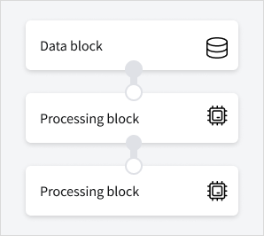

# Workflows and jobs

Apply analytics on geospatial data by using workflows with [data blocks](https://docs.up42.com/processing-platform/blocks/data) and [processing blocks](https://docs.up42.com/processing-platform/blocks/processing).

## Step 1. Create and populate a workflow

A workflow is a sequence of data blocks and processing blocks. It defines an order for operations.

A workflow starts with a data block and is usually followed by one or more processing blocks.



1. Create a workflow and populate it with blocks, for example:
  ```python
  project = up42.initialize_project()

  workflow = project.create_workflow(name="My workflow with Processing from Storage")
  workflow.add_workflow_tasks([
    "Processing from Storage"
  ])
  ```
1. If needed, search for compatible blocks:
  ```python
  workflow.get_compatible_blocks()
  ```
  The search outputs a dataframe with blocks that can be added to your workflow, for example:
  ```python
  workflow.add_workflow_tasks([
    "Sharpening Filter"
  ])
  ```

## Step 2. Retrieve an input schema

Retrieve input parameters of the first block in a workflow:
```python
workflow.get_parameters_info()
```
For example, Processing from Storage requires `asset_ids` as input parameters:
```json
{
  "up42-processing-from-storage:1": {
    "asset_ids": {
      "type": "array",
      "default": "None",
      "required": true
    }
  }
}
```

## Step 3. Configure an AOI

If you use storage data [as a data source](https://docs.up42.com/processing-platform/workflows-jobs/process-storage), skip this step.

```python
# geometry = up42.read_vector_file("data/aoi_washington.geojson")
# geometry = up42.get_example_aoi()
geometry = {
    "type": "Polygon",
    "coordinates": (
      (
          (13.375966, 52.515068),
          (13.375966, 52.516639),
          (13.378314, 52.516639),
          (13.378314, 52.515068),
          (13.375966, 52.515068),
        ),
    ),
}
```

## Step 4. Adjust JSON parameters

Define how data retrieval and analysis will be performed during a job run, for example:
```python
input_parameters = workflow.construct_parameters(
    geometry=geometry,
    geometry_operation="bbox",
    start_date="2020-01-01",
    end_date="2022-12-31",
    limit=1,
)
input_parameters["esa-s2-l2a-gtiff-visual:1"].update({"max_cloud_cover": 5})
```

## Step 5. Make a test query

A test query doesn't consume credits. It searches for available data based on your parameters and provides JSON metadata and low resolution quicklooks of available images.

```python
workflow.test_job(input_parameters, track_status=True)
```

## Step 6. Get a cost estimate

Get a cost estimation before running a live job:
```python
workflow.estimate_job(input_parameters)
```

## Step 7. Run a job

```python
job = workflow.run_job(input_parameters, track_status=True)
```

## Step 8. Get results

You can download and visualize the results:

```python
job.download_results()
job.plot_results()
```