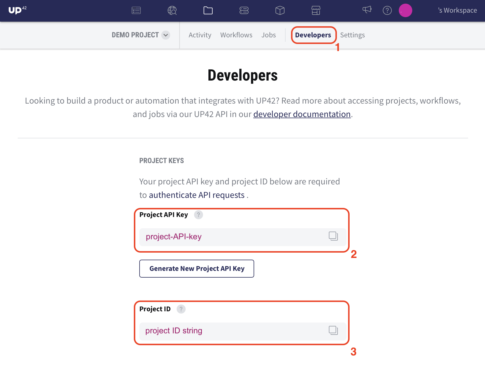

# :key: Authentication

To create and run workflow you first need to authenticate with **UP42** via your **project credentials**.

## Get your Project credentials

Log in to **[UP42.com](https://console.up42.com)** and create a new project or select an existing one.
In the project's **Developers section** you can find the **project_id** and **project_api_key**.



 
## Authenticate  

Authenticate by passing the project credentials directly **as arguments**:

```python
import up42
up42.authenticate(project_id="123", project_api_key="456")
```

Alternatively, create a **configuration json file** and pass its file path:
 
```json
{
  "project_id": "123",
  "project_api_key": "456"
}
```

```python
import up42
up42.authenticate(cfg_file="config.json")
```
