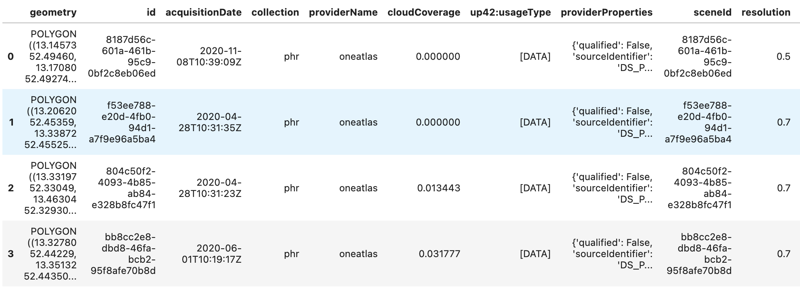

# :world_map: Search & Order Data

[](https://mybinder.org/v2/gh/up42/up42-py/master?filepath=examples%2Fguides%2Fcatalog.ipynb)

This chapter gives a quick example on how to search & purchase data with the UP42 catalog.

## Authenticate

First connect with UP42 as explained in the [authentication chapter](authentication.md)

```python
import up42
up42.authenticate(project_id="your project ID", project_api_key="your-project-API-key")
```

## Search image in the catalog

For the catalog search, first define the desired data collection, area of interest, time period etc. 
with the help of the [construct_parameters](catalog-reference.md#up42.catalog.Catalog.construct_parameters) function. 
The search outputs a dataframe with the available satellite images.

```python
catalog = up42.initialize_catalog()
```

```python
collections = catalog.get_collections()
print([c["name"] for c in collections])

# E.g. Pleiades Neo (`pneo`), Pleiades (`phr`), Spot (`spot`) etc.
```

```python
aoi = up42.read_vector_file("data/aoi_washington.geojson")
```

```python
search_parameters = catalog.construct_parameters(geometry=aoi, 
                                                 start_date="2019-01-01",
                                                 end_date="2021-12-31",
                                                 collections=["phr"],
                                                 max_cloudcover=20,
                                                 sortby="cloudCoverage", 
                                                 limit=10)
```
```python
search_results = catalog.search(search_parameters=search_parameters)
```




## Order the image

When you have decided on a specific image in the search results you can purchase it by placing an order. 
Before ordering the image, estimate the order price. After the order is finished the image is 
available in the UP42 user storage.

```python
catalog.estimate_order(geometry=aoi, scene=search_results.loc[0])
```

```python
order = catalog.place_order(geometry=aoi, scene=search_results.loc[0])
```

## Download the image

You can check the status of the order via `order.status`. If you want to continuously track the
order status until it is finished, use `order.track_status()`. To then download the image assets use:

```python
assets = order.get_assets()
assets[0].download()
```


<br>

!!! Success "Success!"
Also see the advanced examples & code reference or continue with the [Run an analytics workflow](30-second-example.md) 
chapter!
