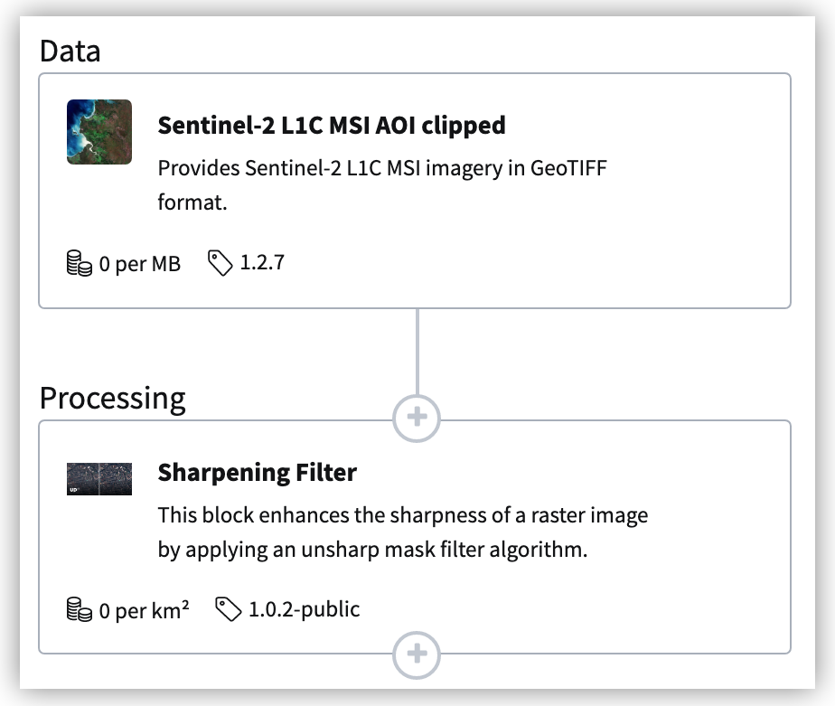
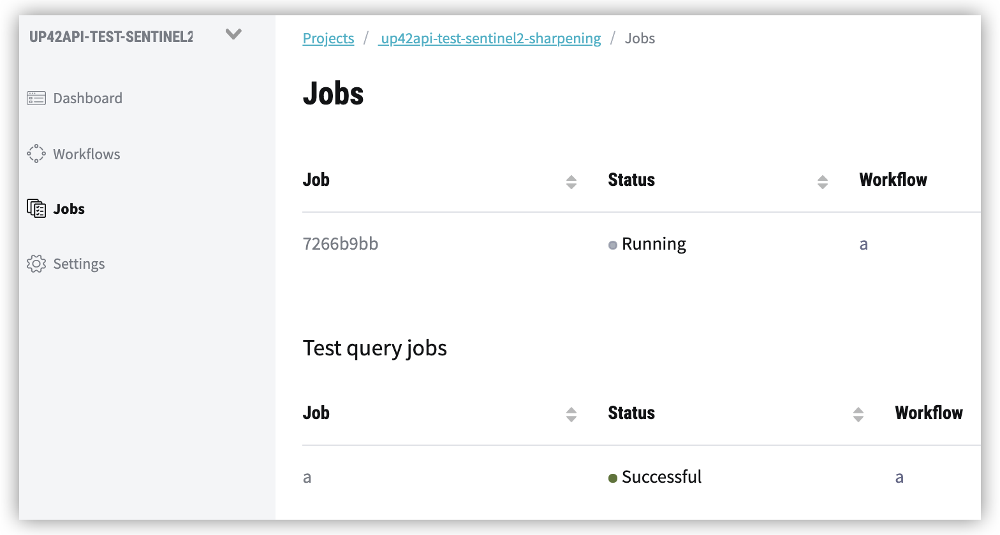

# :national_park: Typical Usage

This overview of the most important functions repeats the previous 30-seconds-example, but in more detail and shows additional functionality and alternative steps.

## Authenticate & access project


```python
import up42
up42.authenticate(porject_id=12345, project_api_key=12345)
# up42.authenticate(cfg_file="config.json")

project = up42.initialize_project()
```

Get information about the available blocks to later construct your workflow.


```python
up42.get_blocks(basic=True)
```

## Create or access the workflow
You can either create a new workflow, use project.get_workflows() to get all existing workflows within the project, or access an exisiting workflow directly via its workflow_id.

Example: Sentinel 2 streaming & sharpening filter

<p align="center">
    
</p>


```python
# Create a new, empty workflow.

workflow = project.create_workflow(name="30-seconds-workflow", use_existing=False)
workflow
```


```python
# Add workflow tasks - simple version

input_tasks= ["a2daaab4-196d-4226-a018-a810444dcad1", "4ed70368-d4e1-4462-bef6-14e768049471"]
workflow.add_workflow_tasks(input_tasks=input_tasks)
```


```python
# Alternative: Add workflow tasks - complex version, gives you more control about the block connections.

input_tasks = [
    {
        "name": "sobloo-s2-l1c-aoiclipped:1",
        "parentName": None,
        "blockId": "a2daaab4-196d-4226-a018-a810444dcad1"
    },
    {
        "name": "sharpening:1",
        "parentName": "sobloo-s2-l1c-aoiclipped:1",
        "blockId": "4ed70368-d4e1-4462-bef6-14e768049471"
    }
]

workflow.add_workflow_tasks(input_tasks=input_tasks)
```


```python
# Check the added tasks.

workflow.get_workflow_tasks(basic=True)
```


```python
#workflow.get_jobs()
```


```python
# Alternative: Get all existing workflows within the project.

all_workflows = project.get_workflows()
workflow = all_workflows[0]
workflow
```


```python
# Alternative: Directly access the existing workflow the id (has to exist within the accessed project).

UP42_WORKFLOW_ID="7fb2ec8a-45be-41ad-a50f-98ba6b528b98"
workflow = up42.initialize_workflow(workflow_id=UP42_WORKFLOW_ID)

workflow
```

## Select the aoi

There are multiple ways to select an aoi:  
- Provide aoi the geometry directly in code as a FeatureCollection, Feature, GeoDataFrame, shapely Polygon or list of bounds coordinates.  
- Use .draw_aoi() to draw the aoi and export it as a geojson.  
- Use .read_vector_file() to read a geojson, json, shapefile, kml or wkt file.  
- Use .get_example_aoi() to read multiple provided sample aois.  


```python
aoi = [13.375966, 52.515068, 13.378314, 52.516639]
```


```python
aoi = workflow.read_vector_file("data/aoi_berlin.geojson", as_dataframe=True)
aoi.head(1)
```


```python
#aoi = workflow.get_example_aoi(location="Berlin")
#aoi
```


```python
#workflow.draw_aoi()
```

## Select the workflow parameters

There are also multiple ways to construct the workflow input parameters:  
- Provide the parameters directly in code as a json string.  
- Use .get_parameters_info() to get a an overview of all potential parameters for the 
selected workflow and information about the parameter defaults and ranges.   
- Use .get_input_parameters(aoi_type="bbox", aoi_geometry=aoi) to construct the parameters 
with the provided aoi and all default parameters. Selecting the aoi_type is independent 
from the provided aoi, you can e.g. provide a irregular Polygon and still select aoi_type="bbox", 
then the bounding box of the polygon will be selected.  


```python
workflow.get_parameters_info()
```


```python
input_parameters = {
  "sobloo-s2-l1c-aoiclipped:1": {
    "bbox": [13.375966, 52.515068, 13.378314, 52.516639],
    "ids": None,
    "time": "2018-01-01T00:00:00+00:00/2020-12-31T23:59:59+00:00",
    "limit": 1,
    "zoom_level": 14,
    "time_series": None,
    "max_cloud_cover": 30
  },
  "sharpening:1": {
    "strength": "medium"
  }
}
```


```python
input_parameters = workflow.construct_parameters(geometry=aoi, geometry_operation="bbox", limit=1)
input_parameters
```


```python
# Further update the input_parameters manually
input_parameters["sobloo-s2-l1c-aoiclipped:1"].update({"max_cloud_cover":60})
input_parameters
```


## Test & Run the workflow & download results

```python
# Run a test job to query data availability and check the configuration.
test_job = workflow.test_job(input_parameters=input_parameters, track_status=True)
test_results = test_job.get_results_json()
print(test_results)
```


```python
# Run the actual workflow.
job = workflow.run_job(input_parameters=input_parameters, track_status=True)
```

<p align="center">
    
</p>

## Download & Display results


```python
# Download job result (default downloads to Desktop). Only works after download is finished.
results_fp = job.download_results()
```


```python
job.plot_results()
```


```python
job.map_results()
```


```python

```
